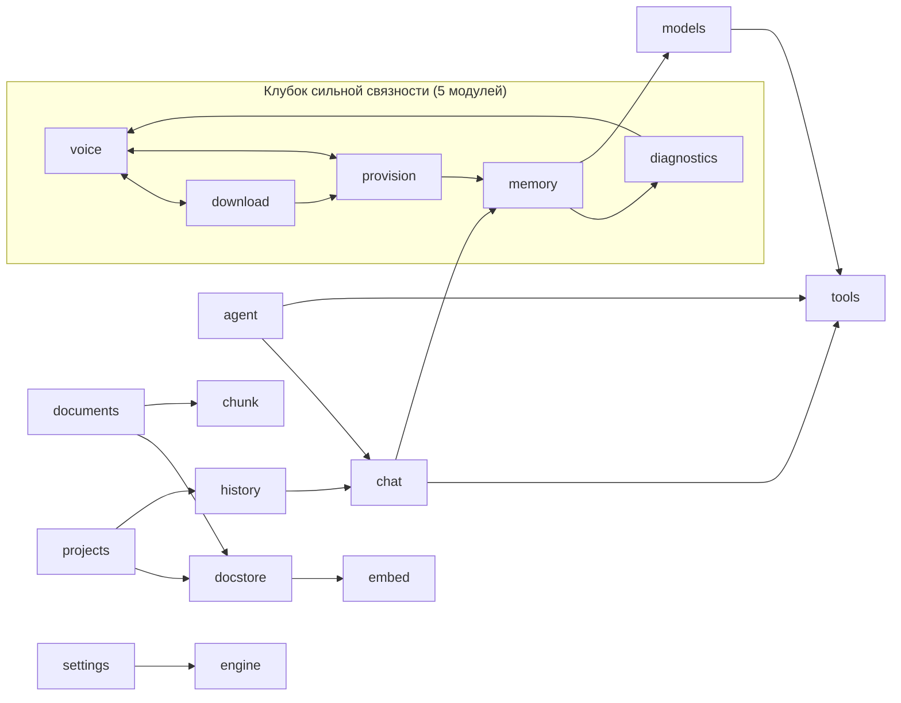

# A1 — Архитектура и границы

Дата: 2026-08-04. Ревизия: `3ae5bbe`. Уровни доказательства: E0 — чтение исходников, E1 — статический инструмент, E2 — воспроизведено запуском, E3 — требует целевой среды.

Ядро этапа по заданию заказчика — машинная сверка IPC-контракта (раздел 4 и файл `ipc-contract.md`); второй обязательный вопрос — доставка движка и моделей (раздел 1).

## 1. Как Ollama и веса моделей попадают на машину клиента (вопрос уровня P0)

В бандле приложения их **нет** — `tauri.conf.json` не содержит ни `externalBin`, ни `resources` (E0). Это не дыра, а осознанная архитектура доставки; полная цепочка (E0, файлы построчно):

1. **Флешка собирается** `tools/make-usb.sh` (строки 1–46): `Windows/` — `Установить.bat` + `Jarvis.AI_*-setup.exe` + `OllamaSetup.exe`; `Linux/` — `install.sh` + `.deb` + `.AppImage` + `ollama-linux-amd64.tgz` (перепакованный из `.tar.zst`, чтобы клиенту не нужен был zstd); `models/` — manifests+blobs из локального Ollama; `models-stt/` — модель распознавания. Версия движка **зафиксирована**: `OLLAMA_VER="v0.32.5"` (make-usb.sh:44) — клиенту уезжает та связка, на которой тестировали.
2. **Движок ставит скрипт с флешки, не пользователь**: Windows — `OllamaSetup.exe /VERYSILENT` per-user без прав администратора (Установить.bat); Linux — `sudo tar -C /usr/local` из архива на флешке (install.sh:26-36). Сценария «клиент сам скачивает Ollama» нет; подсказка «curl ollama.com/install.sh» появляется только если архива на флешке нет (install.sh:39).
3. **Приложение ставится вторым шагом** тех же скриптов; на Linux при провале `.deb` (нет интернета — не дотянуть системные библиотеки) предусмотрен рабочий откат на самодостаточный AppImage (install.sh:68-96) — этот отказ уже случался и закрыт.
4. **Модели импортирует само приложение**: при первом запуске мастер установки находит носитель (`find_model_sources`) и импортирует `models/` в каталог Ollama (`import_models_from_dir`, `provision.rs`). При недоступном движке мастер честно говорит: «Движок не отвечает: скачать модели из интернета не получится. Импорт с флешки при этом работает» (wizard.ts:141).
5. **Поиск движка приложением** — цепочка без зашитых путей (engine.rs:92-118): override из настроек → бинарь рядом с приложением (задел под будущую поставку в бандле) → PATH → типовые каталоги установки (на Windows отдельно обработан случай «PATH обновился, но GUI-процесс его не увидел до перелогина», engine.rs:149-156). Не найден → «Движок Ollama не найден. Установите Ollama и перезапустите приложение.» (engine.rs:237).

**Вывод: инвариант 4.2 («дистрибуция с носителя, ничего не скачивается при первом запуске») архитектурно соблюдён.** Скачивание моделей из интернета существует, но как явная альтернатива в мастере и настройках, не как условие работы.

**Но канал ПРОИЗВОДСТВА этой цепочки разорван — F-PROVISIONING-002 (P0).** GitHub Releases содержит установщики только `app-v0.2.0` и `app-v0.3.0` от 11–12.07.2026 (E1: GitHub API); тега 0.4.0 нет, Actions заблокирован, Tauri не кросс-компилирует. Следствия: флешку с текущей версией собрать нельзя; `make-usb.sh --installers` сегодня **молча** положит на флешку «последний релиз» = 0.3.0 — без голосового ввода, без сторожа памяти (PR #35), без типизации ошибок; автообновление (`plugins.updater` → `releases/latest`) тоже застыло на 0.3.0. Всё, что влито за последние 3,5 недели, недоставляемо ни новым, ни существующим клиентам.

## 2. Управляемое состояние и жизненный цикл процесса (E0: lib.rs:27-180)

- **Состояние в Tauri `manage`:** `CancelFlag` — `Mutex<Arc<AtomicBool>>`, каждый запрос кладёт СВОЙ свежий флаг («Стоп» бьёт только по активному стриму, гонка «новый запрос размораживает старый» закрыта, lib.rs:48-62); `models::PullState`; `settings::SettingsLock`; `projects::ProjectsLock`; `engine::EngineState`.
- **HTTP к Ollama** — один статический клиент на процесс, `connect_timeout` 2 с, **без общего таймаута** (стримы живут долго); короткие метазапросы задают свой 10-секундный таймаут на вызов (lib.rs:32-46). Наружу этот клиент не ходит — интернет только у `tools::web_client()`.
- **Отмена без `tokio::select!`** — `with_cancel` опрашивает флаг каждые 200 мс; сброшенный future реально закрывает соединение reqwest (lib.rs:64-82).
- **Навигационный заслон** — самодельный плагин `navigation-guard`: окно нельзя увести с собственного origin; внешние ссылки — только через plugin-opener (lib.rs:151-159).
- **Долговечность записи** — `write_atomic`: tmp-файл с уникальным на процесс именем → fsync файла → rename → fsync каталога на Unix (lib.rs:94-123).
- **Порядок старта** — журнал первым (`journal::init`), затем `--self-check` (выход с кодом — smoke-тест бандла), затем присмотр за памятью распознавателя (lib.rs:165-179).

Хорошее — одной строкой: дисциплина жизненного цикла (свежий флаг отмены на запрос, атомарная запись с fsync, журнал до всего остального) продумана и прокомментирована на уровне, который редко встречается в проектах такого размера.

## 3. Карта Rust-модулей (E1: разбор `use crate::` по 22 файлам)

- **Fan-in:** error 10 (нормально для типа ошибок), journal 5, tools 5, models 4, engine 4.
- **Fan-out:** lib.rs 16 (hub по замыслу — регистратор команд + общие утилиты), diagnostics/provision/voice по 6.
- **Циклы есть:** одна компонента сильной связности из 5 модулей `{voice, download, provision, diagnostics, memory}` — «поставка/голос/железо/память» переплетены двух-, трёх- и четырёхзвенными циклами. Rust это допускает, но это главная зона запутанности: правка в любом из пяти рискует задеть остальные. Чистые листья: chunk, error, tools, update, journal, engine, embed.
- God-модулей в классическом смысле нет; кандидаты на пристальное чтение в A2 — provision.rs (6 исходящих, участник всех циклов), voice.rs, diagnostics.rs.

## 4. IPC-контракт: машинная сверка (ядро этапа)

Полная построчная таблица всех команд и списки расхождений по классам — **`docs/audit/ipc-contract.md`**. Итоговый счёт (E1, шесть агентов извлечения + адверсарная верификация каждого заявления повторным чтением обеих сторон; 32 вердикта CONFIRMED, 1 REFUTED):

| Метрика | Значение |
|---|---|
| Команд в контракте (по `COMMAND_NAMES` = `generate_handler!`) | **54** (не 53, как в раннем счёте) |
| Вызовов `invoke` на фронте | 85 (по модулям: settings.ts 32, models.ts 10, wizard.ts 6, conversations.ts 6, online.ts 6, documents.ts 5 …) |
| Команды, не вызываемые с фронта | 0 |
| Имена команд, отсутствующие в Rust (опечатки) | 0 |
| Расхождения регистра/имён аргументов | **0** (rename_all нигде нет; многословные ключи везде camelCase) |
| Висячие промисы / вызовы без await | 0 (3 намеренных fire-and-forget с `.catch(()=>{})` и комментариями) |
| Формально «без catch» | 0 |
| **Подтверждённые расхождения типов** | 2: `check_model_updates` (потерянное поле `message?`), `run_diagnostics` (сырой AppError → «[object Object]» при IPC-отказе) |
| **«Catch есть, но глотает»** | 3 места: списки диалогов и проектов рендерят отказ чтения как «пусто» |
| **Дефекты сверх заявленного** (глубокая перепроверка «чистых» команд верификаторами) | 6: ложный успех `clear_conversations`; потерянный in-band-статус `reload_engine` (оба вызова); преждевременный успех `save_project`; недостижимая сводка `import_models_from_dir`; гонка позднего reject `voice_start`; повторный вход + блокирующий вызов `install_update_from_disk` |

Вывод: **транспортный слой контракта здоров** (именование, типы, await, регистрация — дисциплина высокая, contract-тест работает), а систематическая слабость — **семантика ошибок на стыке**: фронт в шести местах превращает содержательный отказ Rust в ложное «пусто»/«успех». Это не случайные баги, а повторяющийся паттерн — материал для одного архитектурного правила («отказ чтения ≠ пустой список; in-band-статус обязан ветвиться»), а не шести точечных заплаток.

## 5. Канал событий (вторая половина IPC)

Классических `emit`/`listen` в проекте **нет вовсе** — весь стрим построен на `tauri::ipc::Channel`, передаваемых аргументами команд: `ChatEvent` (чат/агент), `PullEvent` (все четыре установки), `IndexProgress` (индексация). Формы payload сверены с TS-типами побайтно — расхождений нет; утечек подписок нет (Channel в Tauri 2 сам чистит колбэк по завершению; «хвост» после финала везде гасится guard-переменными settled/opGen/myGen). Две мелочи: `ChatEvent::Done` излучается (chat.rs:313), но обработчика нет — осознанно, финал берётся из результата команды; фаза `"store"` обещана комментарием documents.rs:275 и не существует.

## 6. Потоки данных: три сценария (полная трассировка — в материалах сессии; здесь — выводы)

**Данные на диске (все — в `appDataDir`, авторитетные источники):** `conversations/<id>.json` (диалоги, write_atomic+fsync), `documents.db` (SQLite+sqlite-vec, WAL), `settings.json`, `projects.json`, `outbound_log.json` (журнал исходящих для 152-ФЗ), `stt/ggml-small.bin` (модель распознавания), `appLogDir/jai.log`.

**Обычный чат:** фронт материализует каждое сообщение в чистый `ApiMsg {role, content, images?}` (chat.ts:133-156) — объекты doc/sources в запрос не попадают; Rust добавляет model/think/num_ctx/keep_alive и стримит `POST 127.0.0.1:11434/api/chat` общим localhost-клиентом; ответ возвращается и событиями (рендер), и результатом команды (авторитетный финал). «Стоп» рвёт соединение через свежий флаг отмены.

**RAG:** вопрос → эмбеддинг (bge-m3, `num_gpu:0` — строго CPU) → KNN в sqlite-vec (кандидаты k×5, фильтр по проекту) → отсечка релевантности на фронте (distance ≤ 0.6) → фрагменты пакуются в одно system-сообщение перед вопросом; в историю сохраняются только ссылки `sources`, сам RAG-текст на диск не пишется.

**Инвариант «RAG/док-контент не уходит в Ollama повторно» (инвариант 4.6 задания) — держится, но на одной ноге.** Механика двухслойная: фронт шлёт чистые ApiMsg, а `skip_serializing_if` на `ChatMessage` (chat.rs:96-117) гарантирует, что None-поля не сериализуются в тело `/api/chat`. Все 6 мест (де)сериализации ChatMessage перечислены и сверены (таблица — в трассировке). Точки, где инвариант может сломаться: (1) передай кто-нибудь в `chat_stream` массив `history` как есть (после открытия диалога он содержит doc.text/sources) — `Some`-поля сериализуются, и текст документа уйдёт в тело запроса; страж — только типизация TS, рантайм-проверки нет; (2) `agentic_chat` принимает `Vec<serde_json::Value>` и шлёт дословно (agent.rs:112-125) — фильтра нет вовсе; (3) обратная сторона уже случалась и закрыта тестом: поле, отсутствующее в Rust-структуре, молча терялось при сохранении истории (chat.rs:100-109). → F-RAG-001 (P3, с уточнением: Ollama локальна, наружу данные не уходят — риск гигиенический, не сетевой).

**Голос:** аудиобуфер ограничен (`cap = hz×каналы×120 с`, совпадение констант фронта и Rust охраняет тест voice.rs:780-797); поток cpal живёт в собственном потоке ОС, создание и уничтожение в одном потоке; Esc-отмена дожидается закрытия устройства и **выбрасывает буфер** (voice.rs:669-678) — записанное не распознаётся.

## 7. Границы ответственности и копии состояния

**Разделение труда чистое:** фронт решает *какую* модель (роль по задаче + светофор железа + ручной выбор), Rust решает *поместится ли и как* (`plan_inference`: снизить контекст → модель легче → отказ) и владеет установкой/движком, Ollama исполняет. Фронт с Ollama напрямую не разговаривает. Утверждение PR #30 «набор моделей — один источник» подтверждено (const MODEL_SET → команда model_states → state.modelSet), с двумя оговорками: захардкоженный фолбэк `"bge-m3"` в documents.ts:300 и полный дубликат набора в фикстуре state.test.ts:12-18 (разойдётся молча — но это тест).

**Настройки:** единственное хранилище settings.json под мьютексом; фронт — «загрузил раз → кэш → write-through» (fire-and-forget). Важная правильная деталь: `agent.rs:85` перечитывает `online_mode` из файла при каждом `agentic_chat` — серверный гейт не доверяет фронтовому кэшу (верное направление для 152-ФЗ). Риск write-through: при отказе `set_setting` фронт живёт с «сохранённым» значением до перезапуска — расхождение в безопасную сторону только у онлайн-тумблера, у остальных просто теряется настройка.

**Копии одного и того же (полный список из 15 пар — в трассировке), опасные — три:** (1) `NUM_CTX_DEFAULT = 8192` живёт в трёх местах (chat.ts:63, chat.rs:150, agent.rs:92) без теста-стража — при падении plan_inference фронт и Rust считают бюджет от своих констант; (2) адрес `http://127.0.0.1:11434` повторён в ≥5 модулях — не общая константа; (3) кэш карточек диалогов инвалидируется парой mtime+размер (history.rs:84-95) — запись того же размера в пределах гранулярности mtime оставит карточку устаревшей. → F-BACKEND-003 (P3), кэш — материал A2.

## Находки этапа

Внесены в `findings.jsonl`: **F-PROVISIONING-002 (P0)** — разорванный канал производства установщиков (раздел 1); **F-FRONTEND-002 (P1)** — отказ чтения истории/проектов рендерится как «пусто»; **F-BACKEND-001 (P1)** — ложный успех очистки истории; **F-FRONTEND-003 (P2)** — потерянный in-band-статус reload_engine; **F-FRONTEND-004 (P2)** — преждевременный «Инструкции сохранены»; **F-FRONTEND-007 (P2, уверенность средняя)** — гонка позднего reject voice_start; **F-FRONTEND-005/006/008, F-BACKEND-002/003, F-RAG-001 (P3)**. Транспортный слой IPC — хорошее, одной строкой: 54/54 команды без единого расхождения имён и типов аргументов, 85/85 вызовов с await и обработкой, contract-тест реально работает.

## Слепые зоны этого отчёта

| Что не проверено | Почему | ID эксперимента |
|---|---|---|
| Гонка позднего reject voice_start (окно интерливинга) | нужен рантайм с реальным микрофоном | V-008 |
| Фактическое поведение при отказах чтения (заблокированный файл, антивирус) | нужна целевая машина Windows | V-009 |
| Реальный порядок «событие vs результат команды» в Channel (сводка импорта) | нужен рантайм | V-010 |
| Поведение updater при недоступном GitHub | нужен рантайм + сеть | V-011 (связан с F-PROVISIONING-002) |
